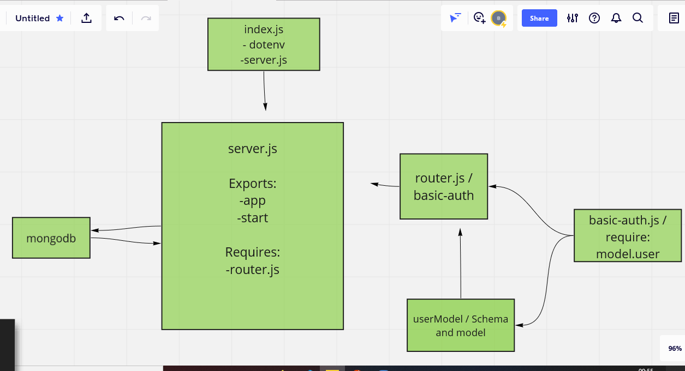

# basic-auth

## My notes

I create a server for the backend and some test

## Pull_request for the repo

https://github.com/baraahalomari/basic-auth/pull/2

## Github actions

https://github.com/baraahalomari/basic-auth/actions

## Heroku applications

https://balomari-basic-auth.herokuapp.com/

## UML diagram

